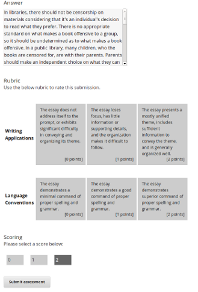

```{r echo=FALSE, warning=FALSE, results='hide', message=FALSE}
wd="/home/vik/mitx_all/vik_sandbox/grading_slides/Freeform_Grading"
setwd(wd)
load("plotdata.RData")
library(ggplot2)
```
## Freeform Grading Overview

#### What is freeform grading?
* A set of technologies that enable feedback and scores to be generated for open ended student responses.
* Includes and integrates: peer grading, self assessment, artificial intelligence (AI) assessment, and instructor grading. 

#### Why is freeform grading important?
* Allows grading of questions not supported by simple computational heuristics.
* Permits use of Socratic method in learning sequences on open-ended topics. 
* Allows students to learn by reviewing and discussing work. 

---
## Self Assessment
* Self assessment allows students to answer a question, see a rubric, and rate themselves.
  * Requires no grading effort from course staff.
  * Particularly valuable in learning sequences where the goal is to learn by constructing knowledge.
  * Several self assessment questions were piloted in the Fall of 2012 with positive student response.

---
## AI Assessment
* A computer algorithm scores student submission.
  * Machine Learning (ML) creates a model using 100 course staff graded responses. 
  * This model is used to automatically grade students.
  * For many problems, similar to course staff grading each student individually, but with much less effort.
  * Also piloted in the Fall of 2012 (more on this in the coming slides).

---
## Peer Assessment
* Peer assessment involves students giving each other scores and feedback
  * Significant pedagogical value for both the student being graded and the grader.
  * Graders first learn how to grade the problem by looking at instructor graded examples.
  * Features such as smart peer matching and user flagging of inappropriate submissions address concerns with previous online peer grading implementations.

---
## Flexible Assessment Types
* Any of the previous 3 assessement types can be used together.
  * A single student response can pass through any combination of graders.
  * For example, a response could be self-assessed, then ML graded. If the two mismatch, peer grading can be used to confirm.

---
## Current Student Problem Interface
Student Submission  |  Student Self-Assesses | External Grader Results
------------- | ------------- | -------------
 |  | 

---
## 2012 Fall Pilot

#### Overview
* AI assessment and self assessment were piloted in a chemistry course (3.091x) to gauge student reactions and to give us data to strengthen our products.

#### Results
* Self Assessment
  * Student reaction to self-assessment was positive.
  * Heavily used by course staff due to simplicity of implementation.
* AI Grading
  * The AI grading product used was an early prototype, and accuracy was lower than it is now.
  * Student surveys indicated that the score was very accurate, but that there needed to be more feedback attached.

#### Takeaways/Lessons
* Give students better feedback from all grader types.
* Give students a way to discuss their scores (we incorporated our survey mechanism late).

---
## Pilot Questions
Distillation  |  Crosslinking | Surfactants
------------- | ------------- | -------------
 |  | 

---
## Pilot Student Data

```{r fig.width=14, fig.height=8, echo=FALSE, warning=FALSE, results='hide', message=FALSE}
student_satisfaction_bar
```

---
## Pilot ML Accuracy

```{r fig.width=14, fig.height=8, echo=FALSE, warning=FALSE, results='hide', message=FALSE}
ml_scoring_dot
```

---
## Pilot ML Accuracy - No Color

```{r fig.width=14, fig.height=8, echo=FALSE, warning=FALSE, results='hide', message=FALSE}
ml_scoring_dot_nocolor
```

---
## Questions?