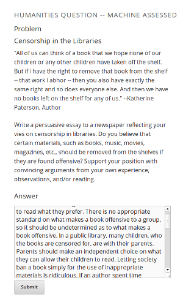
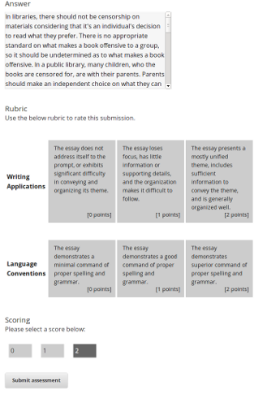
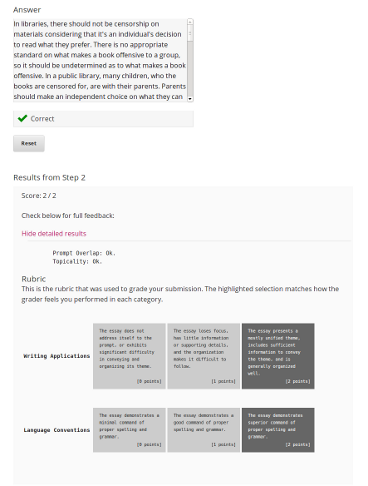
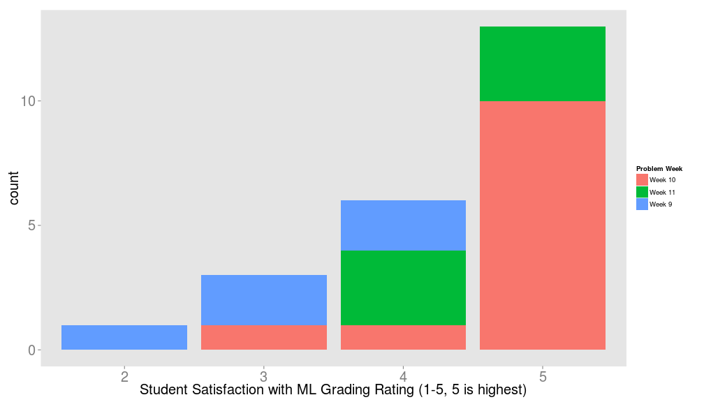
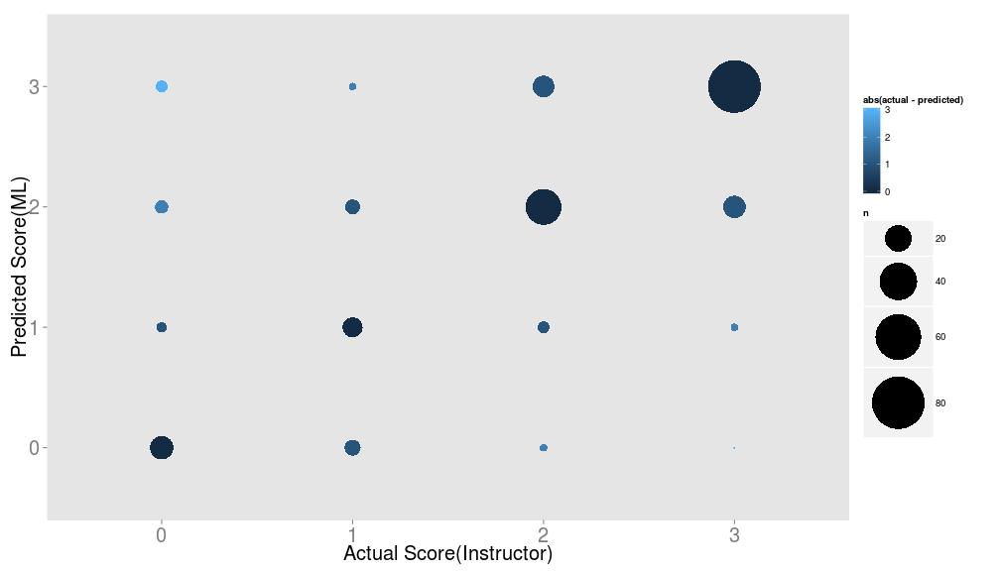

## Freeform Grading Overview

#### What is freeform grading?
* Freeform grading is the automatic scoring of student free text responses.

#### Why is freeform grading important?
* Freeform grading allows humanities courses to be taught using open ended questions.
* Freeform grading can provide feedback to students in a variety of ways that "closed-ended" question types cannot.
* Allowing students to interact with open ended questions has significant pedagogical value.

#### What does edX have to allow freeform grading?
* The learning sciences team at edX has been developing several prototype grading technologies to score free form responses.
  * The development has been user-driven, and all of the technologies offer significant flexibility.

---
## Freeform Grading at edX

#### Self Assessment
* Self assessment allows students to answer a question, see a rubric, and rate themselves.
  * Has pedagogical value for the student, and requires no grading effort from course staff.
  * Several self assessment questions were piloted in the Fall of 2012 with positive student response.

#### Machine Learning (ML) Assessment
* ML assessment involves students submitting a response, and an algorithm scoring it.
  * ML creates a model using 100 course staff graded responses. This model is then used to automatically grade students.
  * Somewhat equivalent to course staff grading each student individually, but with much less effort.
  * Also piloted in the Fall of 2012 (more on this in the coming slides).

---
## Freeform Grading at edX Continued

#### Peer Assessment
* Peer assessment involves students giving each other scores and feedback
  * Significant pedagogical value for both the student being graded and the grader.
  * Graders first learn how to grade the problem by looking at instructor graded examples.
  * Features such as smart peer matching and user flagging of inappropriate submissions address concerns with previous online peer grading implementations.

#### Flexible Assessment Types
* Any of the previous 3 assessement types can be used together.
  * A single student response can pass through any combination of graders.
  * For example, a response could be first peer graded, and then ML graded, after which students could self-assess their performance.

---
## Current Student Problem Interface
Student Submission  |  Student Self-Assesses | External Grader Results
------------- | ------------- | -------------
 |  | 

---
## 2012 Fall ML Pilot

#### Overview
* ML grading and self assessment were piloted in a chemistry course (3.091x) to gauge student reactions and to give us data to strengthen our products.

#### Results
* Self Assessment
  * Student reaction to self-assessment was positive.
  * Heavily used by course staff due to simplicity of implementation.
* ML Grading
  * The ML grading product used was an early prototype, and accuracy was lower than it is now.
  * Student surveys indicated that the ML score was very accurate, but that there needed to be more feedback from the ML.

#### Takeaways/Lessons
* Give students better feedback from all grader types.
* Give students a way to discuss their scores (we incorporated our survey mechanism late).

---
## Pilot Student Data

 

---
## Pilot ML Accuracy

 

---
## Questions?
